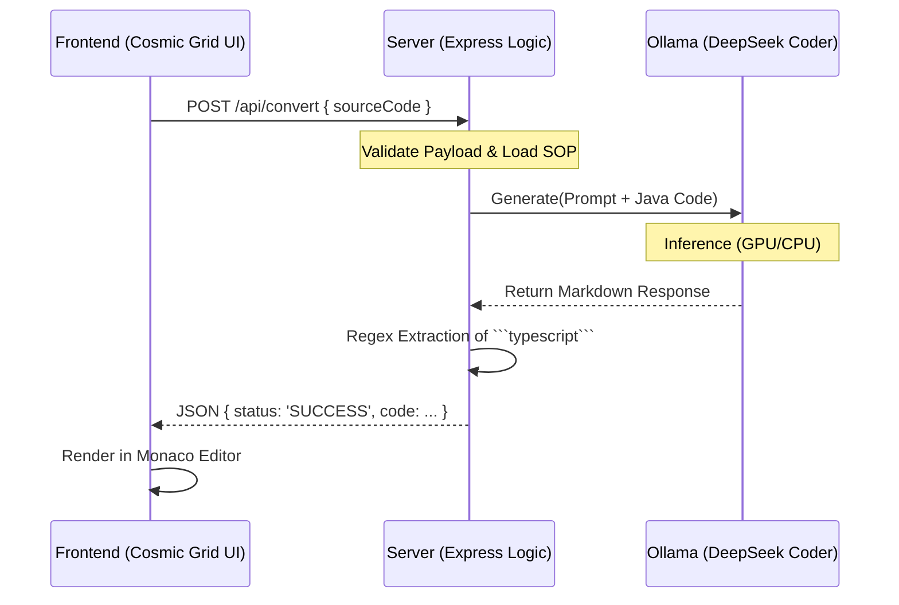

# 🚀 B.L.A.S.T. Engine | Selenium to Playwright Converter

  

**B**lueprint. **L**ink. **A**rchitect. **S**tylize. **T**rigger.

An intelligent, AI-powered migration assistant that converts legacy **Selenium (Java)** test automation code into modern **Playwright (TypeScript)** scripts. It runs entirely on your local machine using **DeepSeek Coder** via Ollama, ensuring zero data leakage.

---

## 🧠 System Architecture

The system follows a strict **3-Layer Architecture** ensures reliability and separation of concerns.

```mermaid
graph TD
    User[👩‍💻 User] -->|1. Pastes Java Code| UI[Frontend (React/Vite)]
    UI -->|2. Sends JSON Payload| API[Backend (Express Node.js)]
    API -->|3. Construct Prompt| LLM[Local AI Engine (Ollama)]
    
    subgraph Local_Machine [Your Machine]
        UI
        API
        LLM
    end
    
    LLM -->|4. DeepSeek generates TS| API
    API -->|5. Clean & Format| UI
    UI -->|6. Display Result| User
```

---

## ⚡ Logical Flow

How a conversion request travels through the system:



---

## 🛠️ Tech Stack

### **Frontend (The Cosmic Grid)**
-   **Framework**: [React 18](https://react.dev/)
-   **Build Tool**: [Vite](https://vitejs.dev/) (Instant HMR)
-   **Styling**: Custom CSS variables, Glassmorphism, Animated Grid.
-   **Editor**: `@monaco-editor/react` (VS Code engine).
-   **Icons**: `lucide-react`.

### **Backend (The Logic Layer)**
-   **Runtime**: Node.js
-   **Framework**: Express.js
-   **Connectivity**: Axios (HTTP Client).
-   **CORS**: Secure cross-origin resource sharing.

### **AI Engine (The Brain)**
-   **Host**: [Ollama](https://ollama.ai/)
-   **Model**: `deepseek-coder` (6.7B parameters).
-   **Privacy**: 100% Local execution.

---

## 🚀 Getting Started

### Prerequisites
1.  **Node.js**: [Download Here](https://nodejs.org/)
2.  **Ollama**: [Download Here](https://ollama.ai/)
3.  **Pull the Model**:
    ```bash
    ollama pull deepseek-coder
    ```

### Installation
1.  Clone the repo:
    ```bash
    git clone https://github.com/aaabhishekgole/Project2_selenium2PlaywriteLocalLLM.git
    cd Project2_selenium2PlaywriteLocalLLM
    ```
2.  Install Dependencies:
    ```bash
    # Install Backend
    cd backend
    npm install
    
    # Install Frontend
    cd ../frontend
    npm install
    ```

### Running the App (One-Click)
Double-click the **`start_app.bat`** file in the root folder. 

OR run manually:
```bash
# Terminal 1
cd backend && node server.js

# Terminal 2
cd frontend && npm run dev
```

---

## 📁 Project Structure

```bash
Project2_selenium2PlaywriteLocalLLM/
├── architecture/           # Layer 1: SOPs & System Prompts
├── backend/                # Layer 2: Express Server
│   ├── server.js           # Main Entry Point
│   └── Dockerfile          # Container Config
├── frontend/               # Layer 4: React UI
│   ├── src/
│   │   ├── App.tsx         # Main Component (Monaco + Grid)
│   │   └── index.css       # Cosmic Design System
│   └── Dockerfile          # Container Config
├── tools/                  # Layer 3: Helper Scripts
├── start_app.bat           # Windows Auto-Launcher
├── docker-compose.yml      # Container Orchestration
└── README.md               # You are here
```

---

## 🛡️ Docker Support

Deploy anywhere using Docker Compose.

```bash
docker-compose up --build
```
*   Frontend: `http://localhost:5173`
*   Backend: `http://localhost:3001`

---

## 🤝 Contributing
1.  Fork the Project
2.  Create your Feature Branch (`git checkout -b feature/AmazingFeature`)
3.  Commit your Changes (`git commit -m 'Add some AmazingFeature'`)
4.  Push to the Branch (`git push origin feature/AmazingFeature`)
5.  Open a Pull Request

---

**Generated by Antigravity Agent** 🛸
